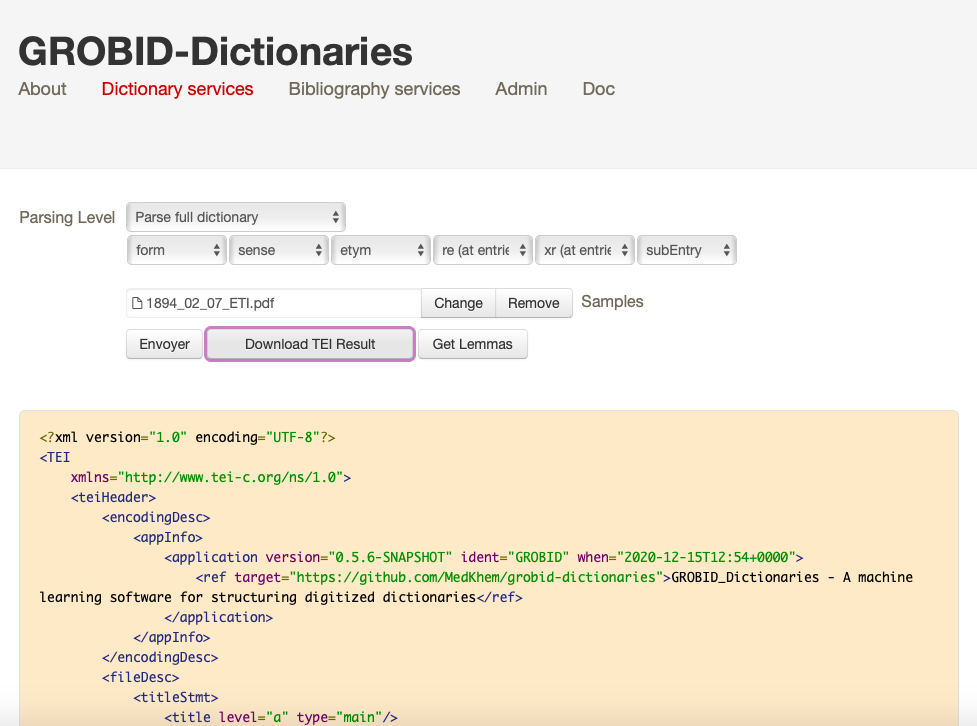

# Encoded TEI-XML catalogues

Digitised manuscripts sale catalogues semantically encoded and restructured in the standardised TEI-XML format (level 1).

* `AUC`: auction catalogues;
* `LAC`: fixed-price catalogues from the collection _Librairie ancienne et autographes de Charavay_;
* `LAV`: fixed-price catalogues from the collection _Catalogue de lettres autographes, manuscrits, documents historiques, etc., d'Auguste Laverdet_.

## Workflow

The PDF scans (images + text layer, *i.e.* the OCR transcriptions generated from the [Transkribus](https://readcoop.eu/transkribus/?sc=Transkribus) software) were parsed on five levels with the _GROBID-Dictionaries_ API:




 and exported into the document in the TEI-XML format, which was corrected manually in the following manner:

* the line-end hyphenation `¬ ` were removed;
* the structure of the document was validated using the pre-existing XML schema below, created by... (e.g. in order to be sure that the entries (items) were enumerated correctly, that each item needs to contain the item's number, author's name, document's description, etc.):

```xml
<?xml-model href="../../_schemas/schema_grobid_output.rng" type="application/xml" schematypens="http://relaxng.org/ns/structure/1.0"?>
<?xml-model href="../../_schemas/schema_grobid_output.rng" type="application/xml" schematypens="http://purl.oclc.org/dsdl/schematron"?>
```

* the TEI metadata were added in the document' header, e.g.:

  * document's `xml:id` code: `<TEI xmlns="http://www.tei-c.org/ns/1.0" xml:id="CAT_000331">`

  * general document title: `<title>Vente Étienne Charavay, 7 décembre 1874, collection Boilly</title>`

  * encoder's name: `<persName ref="#COL_000003">Ljudmila Petkovic</persName>`

  * encoding date: `<date when="2020">2020</date>`

  * full document title: `<title>CATALOGUE DE L'IMPORTANTE COLLECTION DE LETTRES AUTOGRAPHES D'ÉCRIVAINS, D'ARTISTES ET DE SAVANTS</title>`

  * for the fixed-price catalogues, the catalogue's edition number was added: `<num>1</num>`

  * editor: `<editor>Étienne Charavay</editor>`

  * publisher: `<publisher>Jacques Charavay aîné</publisher>  `

  * publication place: `<pubPlace>Paris</pubPlace>`

  * catalogue's release date, or the date of auction (in the short and long format) `<date when="1874">1874</date>` and `<date from="1874-12-07" to="1874-12-10">7-10 décembre 1874</date>`

  * publication place (for the fixed-price catalogues) `<pubPlace>Paris, rue Meslay, 54</pubPlace>` 
    or the address where a certain auction took place`<addrLine>Paris, rue des Bons-Enfants, 28, salle nº 1</addrLine>`

  * auctioneer's name `<persName type="auctioneer">Victorien Louis Jean Baptiste Delbergue-Cormont</persName>` 
    and expert's name:  `<persName type="expert">Étienne Charavay</persName>`

  * the library metadata

    ```xml
                <listWit>
                   <witness>
                      <msDesc>
                         <msIdentifier>
                            <country>France</country>
                            <settlement>Paris</settlement>
                            <institution>Bibliothèque nationale de France</institution>
                            <repository>Richelieu</repository>
                            <idno type="shelfmark">CV-11669</idno> -------------- the IDNO code given by the National Library of France
                         </msIdentifier>
                      </msDesc>
                      <ptr target="http://catalogue.bnf.fr/ark:/12148/cb45023474z"/> ---------- the ark identifier
                   </witness>
                </listWit>
    ```

  * the Transkribus metadata

    ```xml
                <application version="1.11" ident="Transkribus" when="2020"> ---------------- year of processing
                   <label>Transkribus</label>
                   <ptr target="https://transkribus.eu/Transkribus/"/>
                </application>
                <application version="0.5.4" ident="GROBID" when="2020"> -------------- year of processing
    ```

    Sample entry encoding:

    ```xml
                <item n="1">
                   <num>1</num>
                   <name type="author">ADAM (Adolphe),</name>
                   <trait>
                      <p>célèbre compositeur de musique, auteur du Chalet, n. 1803, m. 1836.</p>
                   </trait>
                   <desc>L. a. s. au maire de Rouen ; Paris, 10 novembre 1834, 1 p. in-4</desc>
                   <note>Il accepte la demande que lui a faite le maire de Rouen de se joindre aux compatriotes de Boïeldieu pour lui rendre les honneurs qu'a si bien mérités son beau génie.</note>
                </item>
    ```

    Afterwards, the XSLT transformation was performed using the pre-existing XSL code, which generated the following structure of the same sample entry:

    ```
                <item n="1" xml:id="CAT_000280_e1">
                   <num type="lot">1</num>
                   <name type="author">ADAM (Adolphe)</name>
                   <trait>
                      <p>célèbre compositeur de musique, auteur du Chalet, n. 1803, m. 1836.</p>
                   </trait>
                   <desc xml:id="CAT_000280_e1_d1">L. a. s. au maire de Rouen ; Paris, 10 novembre 1834, 1 p. in-4</desc>
                   <note>Il accepte la demande que lui a faite le maire de Rouen de se joindre aux compatriotes de Boïeldieu pour lui rendre les honneurs qu'a si bien mérités son beau génie.</note>
                </item>
    ```

    The structure of the newly generated document was validated using the another XML schema, created by Lucie Rondeau du Noyer:

    ```xml
    <?xml-model href="../../_schemas/odd_editiones.rng" type="application/xml" schematypens="http://relaxng.org/ns/structure/1.0"?>
    <?xml-model href="../../_schemas/odd_editiones.rng" type="application/xml" schematypens="http://purl.oclc.org/dsdl/schematron"?>
    ```

    

## Cite this repository

Ljudmila Petkovic, Simon Gabay, Matthias Gille Levenson, Alexandre Bartz and Lucie Rondeau du Noyer, _Encoding the manuscripts sale catalogues_, Neuchâtel: Université de Neuchâtel, 2020, [https://github.com/katabase/New_OutputData](https://github.com/katabase/1_OutputData).

## Licence

<a rel="license" href="http://creativecommons.org/licenses/by/4.0/"></a><br />This work is licensed under a <a rel="license" href="http://creativecommons.org/licenses/by/4.0/">Creative Commons Attribution 4.0 International Licence</a>.